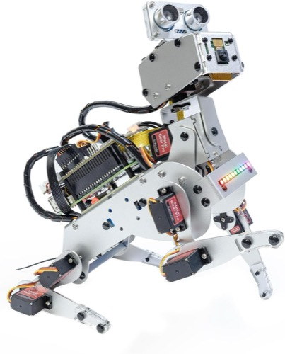
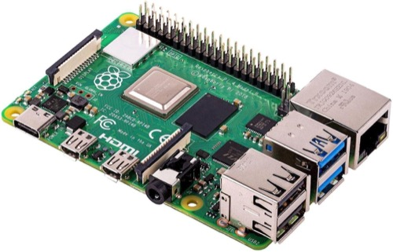

# 🔋 pidog-energy

**Surveillance de batterie pour le robot chien SunFounder PiDog.**
Quand l'énergie baisse, le chien vous le dit — à voix haute.

> *« Énergie faible. 30 pour cent. »*

Service de fond, sans dépendance, qui tourne **en même temps que vos autres
programmes PiDog** — notamment [pidog-voice](https://github.com/koua29/pidog-voice).

---

## Ce qu'il fait

- Lit la tension de la batterie et la convertit en pourcentage
- À chaque palier franchi : **aboie** puis **annonce le niveau à voix haute**
- **Chaque palier n'alerte qu'une fois** — pas de harcèlement à 29 %, 28 %, 27 %…
- **Se tait pendant la charge**
- Se réarme tout seul une fois la batterie rechargée
- Survit aux redémarrages : les paliers déjà annoncés sont mémorisés sur disque

## Trois choix de conception qui comptent

**Il ne bouge aucun servo.** L'alerte est purement sonore. Un robot posé sur une
table peut donc être surveillé sans risque de chute.

**Il n'instancie jamais `Pidog()`.** La tension est lue directement par l'ADC du
robot-hat. C'est ce qui permet à ce service de tourner *en parallèle* de
pidog-voice : deux objets `Pidog` dans deux processus se disputeraient le GPIO.

**Il lit la médiane de 7 mesures.** L'ADC bruite de ±0,08 V ; une lecture isolée
suffirait à déclencher une fausse alerte au passage d'un seuil.

---

## Installation

```bash
git clone https://github.com/koua29/pidog-energy.git
cd pidog-energy
./install/pi_service.sh          # cron @reboot + supervision, aucun sudo requis
```

Vérifier :

```bash
python3 energy.py --etat         # tension, pourcentage, paliers déjà annoncés
tail -f ~/pidog-energy.log
```

Désinstaller : `./install/pi_service.sh --retirer`

## Utilisation manuelle

```bash
python3 energy.py                # service (boucle infinie)
python3 energy.py --etat         # état actuel
python3 energy.py --test 30      # joue l'alerte du palier 30 % sans attendre
python3 energy.py --verifier     # valide config.json
python3 energy.py --oublier      # réarme tous les paliers
```

---

## Configuration

Tout est dans **`config.json`**. Aucun code à modifier.

```json
"alertes": [
  { "pourcent": 30, "aboiements": 3 },
  { "pourcent": 20, "aboiements": 4 },
  { "pourcent": 10, "aboiements": 5,
    "annonce": "Batterie critique. {pourcent} pour cent. Rechargez-moi." }
],
"annonce_par_defaut": "Energie faible. {pourcent} pour cent.",
"rearmement_pourcent": 50
```

| Réglage | Rôle |
|---|---|
| `alertes[].pourcent` | Seuil de déclenchement |
| `alertes[].aboiements` | Nombre d'aboiements avant la phrase (`0` = voix seule) |
| `alertes[].annonce` | Phrase spécifique à ce palier ; `{pourcent}` est substitué |
| `annonce_par_defaut` | Phrase utilisée si le palier n'en définit pas (`null` = aboiements seuls) |
| `rearmement_pourcent` | Au-dessus de ce niveau, tous les paliers redeviennent annonçables |
| `batterie.intervalle_s` | Période entre deux mesures (60 s par défaut) |
| `batterie.lectures_par_mesure` | Nombre de lectures dont on prend la médiane |
| `voix_langue` | Langue de la synthèse `pico2wave` (`fr-FR`) |

Ajouter un palier ne demande qu'un bloc de plus dans `alertes`. Validez ensuite
avec `python3 energy.py --verifier` : il refuse les doublons, les seuils hors
bornes, et un `rearmement_pourcent` placé sous le plus haut palier.

### Une chute rapide déclenche la bonne alerte

Si la batterie passe de 35 % à 8 % entre deux mesures, le service annonce **10 %**,
pas 30 % : il retient toujours le palier le plus bas atteint.

---

## Limites, dites franchement

**Le pourcentage est approximatif.** Il vient d'une conversion **linéaire** de la
tension (8,4 V = 100 %, 6,4 V = 0 %). Or une cellule lithium tient un plateau vers
7,4 V puis chute brutalement : le vrai « 50 % » arrive plus tard que ne l'indique
le calcul. Les bornes sont dans `config.json`, ajustez-les à votre pack.

**La détection de charge est une déduction, pas une mesure.** Le robot-hat
n'expose aucun signal de charge. Le service conclut à une charge en observant une
hausse soutenue de tension, ou une tension de fin de charge (≥ 8,25 V). Deux
conséquences : les toutes premières minutes d'un branchement peuvent lui échapper,
et un pack fraîchement débranché reste un moment considéré comme en charge.

---

## 🤝 Le matériel du projet

*Liens partenaires Amazon : si vous achetez via ces liens, le projet touche une petite
commission, sans surcoût pour vous. Ce sont les trois machines sur lesquelles ce code
a été développé et testé.*

<table>
<tr>
<td align="center" width="33%">
  <a href="https://link.amazon/B0bYWa5Tm"></a><br>
  <b>SunFounder PiDog</b><br>
  <sub>Le robot chien</sub>
</td>
<td align="center" width="33%">
  <a href="https://link.amazon/B0jdCWkVR"></a><br>
  <b>Raspberry Pi 4</b><br>
  <sub>Le cerveau embarqué</sub>
</td>
<td align="center" width="33%">
  <a href="https://link.amazon/B0bhYDJWI"></a><br>
  <b>Apple Mac Mini</b><br>
  <sub>Pour aller plus loin — voir pidog-voice</sub>
</td>
</tr>
</table>

## ☕ Offrez-moi un café

Ce projet est gratuit et open source. S'il vous est utile, vous pouvez me remercier
en m'offrant un café — il suffit de scanner ce QR code PayPal. Merci beaucoup ! 🙏

<p align="center">
  
</p>

## Voir aussi

- **[pidog-voice](https://github.com/koua29/pidog-voice)** — commande vocale française
  pour le même robot. Les deux services tournent ensemble sans conflit.

## Licence

[MIT](LICENSE) © 2026 koua29
